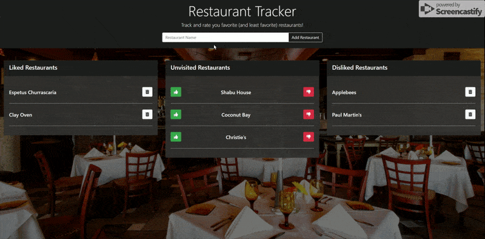
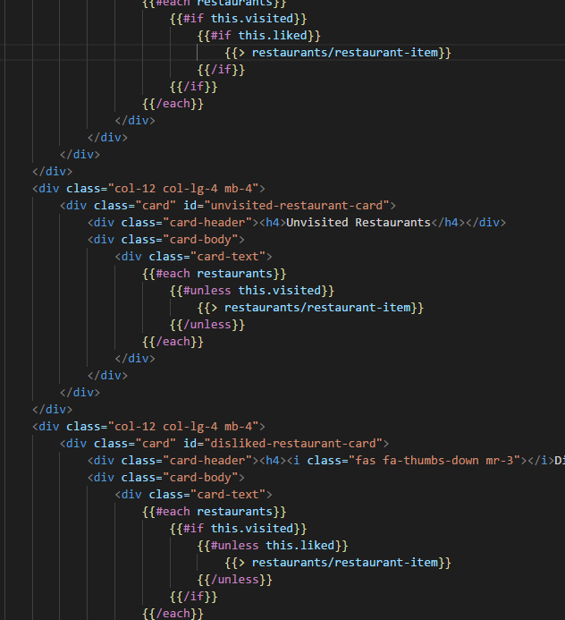
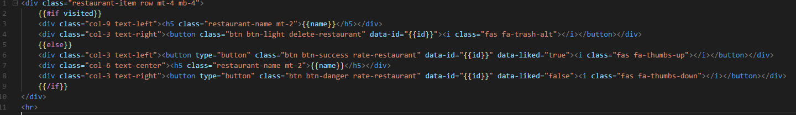
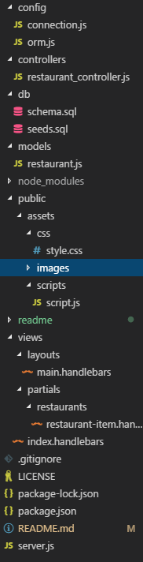

# Restaurant-Tracker
[Restaurant Tracker](https://fathomless-coast-46070.herokuapp.com/)

Create a list of restaurants you wish to visit, and then, after you've visited them, you can decide whether you liked or disliked them!

## Getting Started

Open up the [project link](https://fathomless-coast-46070.herokuapp.com/) and you should be able to see the webpage shown below:

You can add new restaurants in the input field in the header. If you've visited one of the restaurants you can give it a `thumbs up` if you liked it or a `thumbs down` if you didn't. Once you've visited a restaurant, you can choose to remove it from the tracker if you're no longer interested in it.

Check out those restaurants you've always wanted to go to!

### Prerequisites

You need to have a modern browser able to handle html5, javascript, and css. 

### Installing

No installation needed! Just open the page in your preferred browser.

## Built With

* Html

* CSS

* [Javascript](https://www.javascript.com/) - The scripting language used

* [BootstrapCDN v4.1.0](https://getbootstrap.com/docs/4.1/getting-started/introduction/) - The web framework used

* [jQuery v3.3.1](http://jquery.com/) - Java library for DOM and CSS manipulation

* [Google Fonts](https://fonts.google.com/) - Font repository

* [Node.js](https://nodejs.org/en/) - JavaScript runtime

* [Node Package Manager](https://www.npmjs.com/) - Package manager for JavaScript and Node

* [Express](https://www.npmjs.com/package/express) - Server-side framework

* [Body Parser](https://www.npmjs.com/package/cli-table) - Request parsing middleware

* [Handlebars](http://handlebarsjs.com/) - Semantic templates for HTML generation

* [mySQL](https://www.npmjs.com/package/mysql) - Make server-side SQL queries

## Challenges
I dove into Handlebars and the MVC model with this project. Handlebars is very convenient for just serving up pages without having to write a lot of javascript or repeating html.

I explored handlebar's built in conditionals and iterators in order to minimize repeated code. Partials have been incredibly useful for creating dynamic content relatively painlessly.

I took a baby step towards using the MVC model last project, but I fully utilized the model this time. This was a great experience that will prepare me for working with larger projects.

## Authors

* **Robert Shaw** - *Initial work* - [robertshaw87](https://github.com/robertshaw87)
